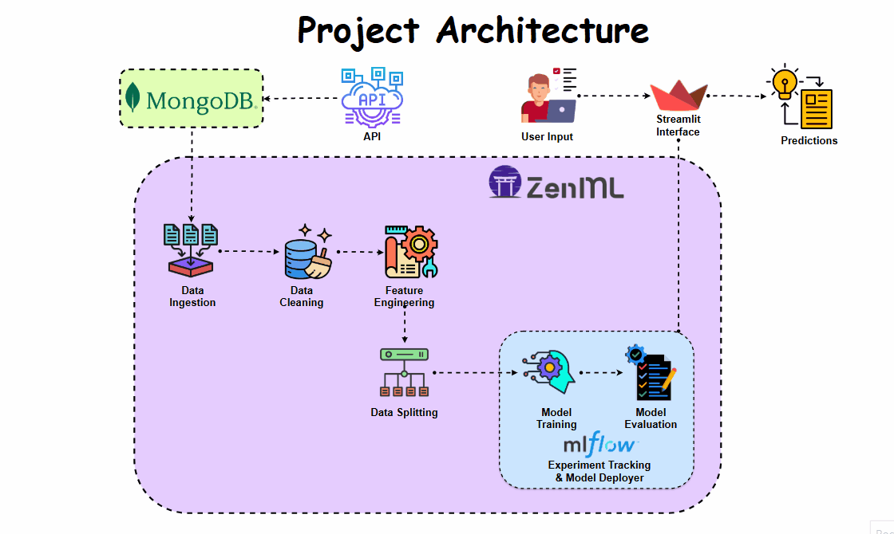
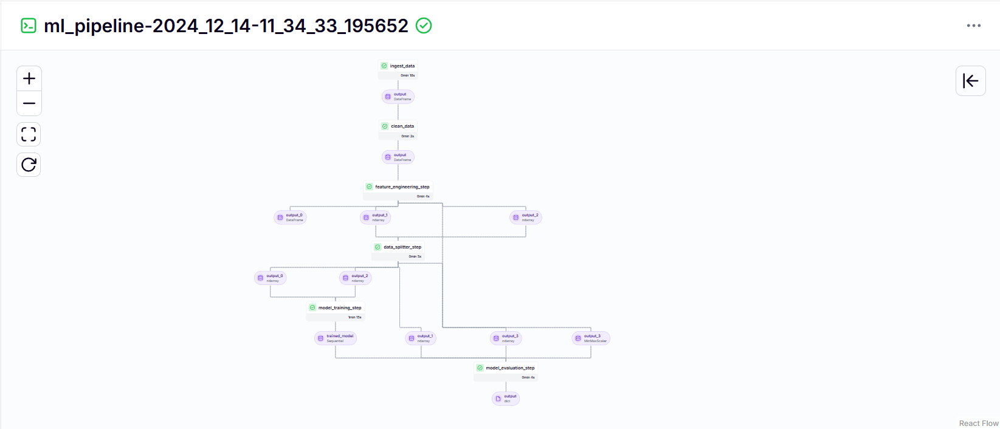
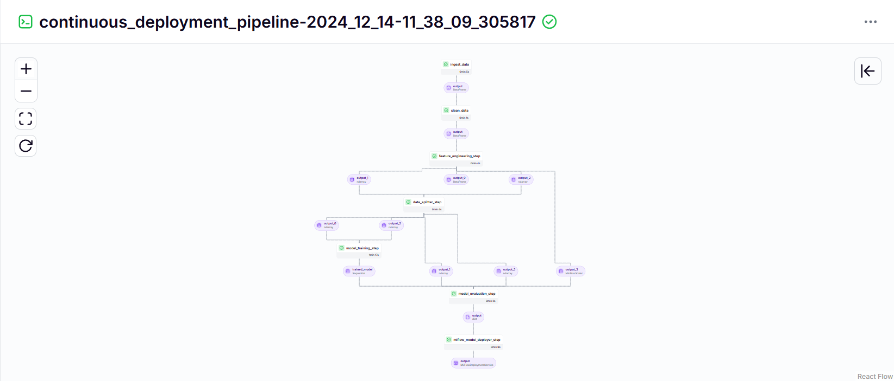
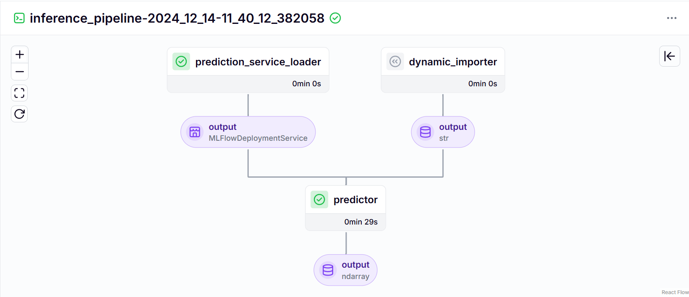

<h1 align="center">Predicting Bitcoin Prices in Real-Time with MLOps 🚀</h1>



## Table of Contents 📚 
1. [Problem Statement](#-problem-statement)
2. [Tech Stack](#-tech-stack) 
3. [Training Pipeline](#-training-pipeline)
4. [Continuous Integration / Continuous Deployment Pipeline](#-continuous-integration-/-continuous-deployment-pipeline)
5. [Local Setup](#local-setup)
6. [Zenml Integration](#zenml-integration)
7. [Running the Project](#Running-the-Project)

## Problem Statement 📝
Cryptocurrency markets are known for their extreme volatility, making price prediction a significant challenge. This project aims to tackle this by developing a robust time-series prediction model using LSTM to forecast cryptocurrency prices and uncover future trends. The implementation leverages automated and modular pipeline orchestration to streamline model retraining and updates. A user-friendly interface built with Streamlit brings these forecasts to life, enabling real-time predictions and insights in a production-ready environment.

## Teck Stack
| **Category**             | **Tools/Technologies**                                  | **Description**                                                |
|--------------------------|---------------------------------------------------------|----------------------------------------------------------------|
| **Frontend**             | Streamlit                                               | Provides an interactive UI for real-time cryptocurrency price predictions. |
| **Backend**              | CryptoCompare API                                       | Supplies historical and real-time cryptocurrency price data.   |
| **Modeling**             | LSTM, Python                                            | Deep learning model for time-series cryptocurrency price forecasting. |
| **Database**             | MongoDB                                                 | Stores historical price data for training and predictions.     |
| **Orchestration**        | ZenML                                                   | Manages and orchestrates the model training and deployment pipeline. |
| **Experiment Tracking**  | MLflow                                                  | Tracks model performance metrics and manages model deployment. |

## Training Pipeline 🚂
In this pipeline, we embark on a journey through various steps to train our model! 

🛤️ Here's the process breakdown:

1. **run_pipeline.py**: Initiates the training pipeline.
2. **ingest_data:** Fetchs raw data from MongoDB using an API into a pandas DataFrame.
3. **clean_data:** Removes unnecessary columns, handle missing values, and prepare the data for processing.
4. **feature_engineering:** Create and scale features to optimize model performance.
5. **steps/data_splitter:** Split the dataset into training and testing subsets for validation.
6. **steps/model_training:** Trains an LSTM model and track it using [MLflow autologging](https://www.mlflow.org/docs/latest/tracking.html).
7. **steps/model_evaluation:** Evaluate the model and log performance metrics with MLflow autologging [MLflow autologging](https://www.mlflow.org/docs/latest/tracking.html).



## Continuous Integration / Continuous Deployment Pipeline ⚙️
The continuous integration pipeline focuses on the production environment and streamlined processes for deployment. 

🔄 Here's how it flows:

1. **deployment_pipeline.py:** Defines the continuous deployment pipeline, which trains the model and deploys it using the MLFlow model deployer step.
2. **run_deployment.py:** Handles the execution of the deployment pipeline and provides an option to stop the prediction service once the deployment is complete.
3. **dynamic_importer.py:** Imports test data dynamically, reshaping it to match the expected model input for predictions.
4. **prediction_service_loader.py:** Retrieves the prediction service started by the deployment pipeline to ensure the model is ready for inference.
5. **predictor.py:** Takes the loaded prediction service and input data, reshapes the data as needed, and performs predictions on it.





## Local Setup 👨🏼‍💻
1. **Clone the Repository**:
```bash
git clone https://github.com/karthikponna/Bitcoin_Price_Prediction_MLOps.git
cd Bitcoin_Price_Prediction_MLOps
```

2. **Set Up a Virtual Environment**:
```bash
# For macOS and Linux:
python3 -m venv venv

# For Windows:
python -m venv venv
```

3. **Activate the Virtual Environment**:
```bash
# For macOS and Linux:
source venv/bin/activate

# For Windows:
.\venv\Scripts\activate
```

4. **Install Required Dependencies**:
```bash
pip install -r requirements.txt
```

5. **Set Up Environment Variables**:
```bash
# Create a `.env` file and add your MongoDB connection string:
MONGO_URI=your_mongodb_connection_string
```

6. **Set Up Free API Key**:
```bash
# Inside the `.env` file, add your CryptoCompare API Key:
API_URI=you_api_key
```

## Zenml Integration 💥
1. Install ZenML - https://docs.zenml.io/getting-started/installation 

2. Install some integrations using ZenML:
```bash
zenml integration install mlflow -y
```

3. Register mlflow in the stack:
```bash
zenml integration install mlflow -y
zenml experiment-tracker register mlflow_tracker --flavor=mlflow
zenml model-deployer register mlflow --flavor=mlflow
zenml stack register local-mlflow-stack-new -a default -o default -d mlflow -e mlflow_tracker --set
```

## Running the Project 🏃‍➡️
Follow these steps to run different components of the project:

1. **Training Pipeline**:
   
   ```bash
    python run_pipeline.py
    ```

2. **Continuous Integration / Continuous Deployment Pipeline**:

   ```bash
    python run_deployment.py
    ```

3. **Streamlit**:

   ```bash
    streamlit run app.py